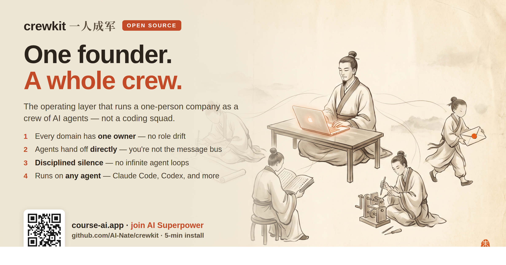

# crewkit



> **Run a one-person company as a crew of AI agents — with an invisible seam.**
> **一个人,像带一支团队一样带一群 AI agent——而人只看到结果,看不到接缝。**

**Not a coding squad.** Almost every "AI agent team" repo hands you a
lead + frontend + backend + tester to *write software*. crewkit is different: it's
for running the **whole company day to day** — content, growth, research, ops,
product — as a crew you operate solo. It's the sanitized operating layer distilled
from the real one-person-company crew behind [AI Nate](https://ai-nate.com), the
one that ships content, runs growth, and builds products without the founder
relaying between the agents.

**不是一支写代码的小队。** 几乎所有「AI agent team」仓库给你的都是 lead+前端+后端+测试去
*写软件*。crewkit 不一样:它是拿来**一个人把整个公司日常跑起来**的——内容、增长、调研、
运营、产品,当成一支 crew 来带。这是从 [AI Nate](https://ai-nate.com) 真实「一人公司」
crew 里提炼、脱敏出来的那层操作规范。

This is **not** another "multi-agent framework." It is the missing **operating
layer** on top of whatever framework you already run: a way to define agents as
**role-owners** (not tool-callers), a coordination protocol that lets them hand
work to each other **without the human relaying**, and a discipline for when an
agent should **shut up**. Bring your own runtime — Claude Code, Cursor, Codex CLI,
a multi-channel agent runtime, anything that reads markdown.

这**不是**又一个多智能体框架。它是你**已有**框架之上缺的那层「操作规范」:把每个
agent 定义成**领域负责人**(而不是工具调用器),给它们一套**不需要人居中转**就能互相交
接的协议,再加一条「什么时候该闭嘴」的纪律。运行时你自己选——Claude Code、Cursor、
Codex CLI、任何多通道 agent 运行时,能读 markdown 的都行。

---

## The problem it solves / 它解决什么

One giant agent with 40 tools becomes a confused generalist. The instinct is to
split into specialists — but the moment you do, you inherit three new problems the
frameworks don't solve for you:

1. **Role drift.** Two agents both think they own the newsletter. Or nobody does.
2. **The human becomes the message bus.** "Ask research, then tell content, then
   send me the result." You're now a router. That doesn't scale to a crew.
3. **The silence problem.** Agents narrate. They post "Acknowledged, standing by,"
   which gets re-injected as a new message, which triggers another reply — and two
   agents ping-pong for an hour while you sleep.

crewkit is the set of files and rules that fix exactly these three.

一个挂了 40 个工具的巨型 agent,会变成一个啥都会一点、啥都不精的糊涂通才。于是你想拆成
专才——可一拆,框架不管的三个新问题就全来了:**① 角色漂移**(两个 agent 都以为 newsletter
归自己,或者都不管);**② 人变成了消息总线**(问 A、告诉 B、再发我——你成了路由器);
**③ 沉默问题**(agent 爱汇报,发一句「收到,待命」,被当成新消息重新注入,触发下一次回复,
两个 agent 在你睡觉时对着空气 ping-pong 一小时)。crewkit 就是专门修这三样的一套文件和规则。

## What's in the box / 包里有什么

| Path | What it is |
|---|---|
| `protocol/CROSS-AGENT.md` | ★ The coordination protocol — the invisible-seam handoff, the silence tokens, the fact-check tier. Harness-agnostic. |
| `templates/IDENTITY.template.md` | Defines a role: **what it owns**, its boundary, its sisters. |
| `templates/SOUL.template.md` | Defines a role's **behavior**: voice, taste, working principles. |
| `templates/ROSTER.template.md` | The one-page map of who owns what — the crew's org chart. |
| `examples/solo-founder-crew/` | A full fictional crew for a one-person company: roster + a worked role + a worked handoff. |
| `docs/` | Per-harness setup: Claude Code · Codex CLI · a multi-channel runtime · any markdown agent. |

## Quickstart (≤5 min) / 快速开始

**Fastest path — let your agent install it.** Clone the repo, open your coding
agent in your workspace, and paste:

```
I cloned https://github.com/AI-Nate/crewkit to ./crewkit.
Read its README + protocol/CROSS-AGENT.md, then help me define my first two
roles from templates/. Start by asking me what the two roles should own.
```

你的 agent 会读完文档,反问你「这两个角色各自负责什么」,然后带你把第一版建起来。

**Manual path:**

1. Clone this repo.
2. Copy `protocol/CROSS-AGENT.md` into every agent's workspace (symlink it if your
   harness supports it — one source of truth, all agents pick up edits).
3. For each role, copy `templates/IDENTITY.template.md` → `IDENTITY.md` and
   `templates/SOUL.template.md` → `SOUL.md` into that role's workspace. Fill them in.
4. Copy `templates/ROSTER.template.md` → `ROSTER.md` at the top and list who owns what.
5. Tell each agent to **read IDENTITY.md, SOUL.md, and CROSS-AGENT.md at session
   start.** Per-harness wiring: [`docs/setup-claude-code.md`](docs/setup-claude-code.md) ·
   [`docs/setup-codex.md`](docs/setup-codex.md) ·
   [`docs/setup-multichannel-runtime.md`](docs/setup-multichannel-runtime.md) ·
   [`docs/setup-any-agent.md`](docs/setup-any-agent.md).

That's it. No new dependency, no server, no API key. It's markdown + your existing runtime.

## The core idea / 核心思想

### 1. A role owns a domain, not a task.

The unit of a crew is a **boundary you can defend in one sentence.** "I own
everything that ships to a customer's inbox." "I own paid acquisition." If two
roles can't tell you which of them owns a given piece of work, the roster is
wrong — fix the roster, not the prompt.

角色的单位是**一句话能说清的边界**,不是一个任务。两个角色说不清某件事归谁,是花名册错
了,不是提示词错了。

### 2. IDENTITY and SOUL are different files on purpose.

- **IDENTITY.md** = *what I own.* Scope, boundary, the canonical answer to "who
  are you," the list of sister roles. Read this to know whether a task is yours.
- **SOUL.md** = *how I behave.* Voice, taste, working principles, the lines I
  won't cross. Read this to know how to do the task once you know it's yours.

Keeping them separate is what lets you change a role's *personality* without
touching its *scope*, and vice versa. Mixing them is the #1 mistake.

### 3. The seam is invisible.

When work belongs to another role, the agent hands it off **directly** to that
role and integrates the reply — the human sees the *outcome*, not the relay. The
protocol ([`CROSS-AGENT.md`](protocol/CROSS-AGENT.md)) describes this as a
pattern; you bind it to whatever inter-agent primitive your framework gives you.

活儿归别人时,agent **直接**交接、拿回结果、整合上报——人看到的是产出,不是那趟传话。

### 4. Silence is a first-class output.

An agent with nothing useful to say must emit an explicit **silence token**, not
a polite meta-reply. "Acknowledged, standing by" is not silence — it's a message
that starts a loop. The protocol defines the tokens and exactly when to use them.
This one rule prevents the most expensive multi-agent failure mode there is.

「没什么可说」时,agent 必须输出一个明确的**沉默 token**,而不是一句客气的「收到待命」。
后者不是沉默,是一条会触发循环的消息。这一条规则,挡住的是多智能体里最烧钱的那种失控。

## FAQ

**Do I need a specific framework?** No. crewkit is the *layer above* the
framework. It works on any runtime where an agent can (a) read files at startup
and (b) send a message to another agent. The `docs/` show three bindings.

**Does this need API keys or a server?** No. It's markdown + your existing agent runtime.

**Is my data sent anywhere?** No. Everything stays in your workspace. `.gitignore`
is pre-set so you never accidentally commit a filled-in crew.

**How many roles should I start with?** Two. Add a third only when you can name a
domain neither of the first two should own. Crews grow by *boundary pressure*, not
by ambition.

**Can one person really run a crew?** That's the entire point. The kit exists so
the coordination overhead of N agents stays near-zero for the one human above them.

## Ethos & responsible use / 立意与负责任使用

A crew multiplies whoever runs it. That cuts both ways, so the line is explicit:

- **Build, don't deceive.** These agents represent *you*. The invisible seam is a
  UX convenience for legitimate work — it is **not** a tool for impersonation,
  astroturfing, or making one person look like a crowd of independent voices.
- **Own what your crew ships.** Every agent's output is your output. Design roles
  you'd put your name on, because you are.

一支 crew 会放大操盘它的人——两个方向都放大,所以把线画明:这些 agent 代表的是**你本人**。
隐形接缝是为正当工作服务的体验,**不是**用来伪装身份、刷量、或把一个人扮成一群独立声音的工具。
crew 发出去的每一句,都是你发的——按你敢署名的标准去设计角色,因为那就是你在署名。

## Who built this / 出处

crewkit is the distilled, sanitized operating layer behind **[AI Nate](https://ai-nate.com)**'s
real crew — a one-person company run as a team of specialized agents that ship
content, run growth, and build products without the founder relaying between them.
The runtime is ours; **the operating pattern is yours, MIT.**

crewkit 是 **[AI Nate](https://ai-nate.com)** 真实 crew 背后那层操作规范的提炼与脱敏版——
一个「一人公司」当团队来带,一群专职 agent 各管一摊,发内容、跑增长、做产品,而创始人不用在
它们之间来回传话。运行时是我们的;**这套操作规范是你的,MIT。**

## Learn to build this — join AI Superpower / 加入 AI 超能力社区

Templates get you started; **building it well is a craft you learn faster with
people already doing it.** **AI Superpower** is our community for learning and
building with AI — from your first two roles to running a whole company as a crew.
Join builders sharing what actually works, get the full walkthrough of how a real
crew is wired end-to-end, and build alongside a live cohort.

**→ Join AI Superpower: [course-ai.app](https://course-ai.app/)**

模板只是起点,**真正把它搭好是一门手艺——和已经在做的人一起学会更快。** **AI Superpower**
是我们一起用 AI 学习和搭建的社区:从你的头两个角色,到把一整家公司当一支 crew 来跑。加入一群
在分享「什么真的管用」的 builder,看一套真实 crew 从头到尾怎么接线,并跟着直播 cohort 一起搭。

**→ 加入 AI Superpower:[course-ai.app](https://course-ai.app/)**

## License

[MIT](LICENSE). Use it, fork it, sell what you build with it.

---

*Built by running it on a real one-person company first. The example crew here is
fictional; the structure is exactly what runs in production.*

*Learning to build with AI? Come build with us → **[AI Superpower · course-ai.app](https://course-ai.app/)***
